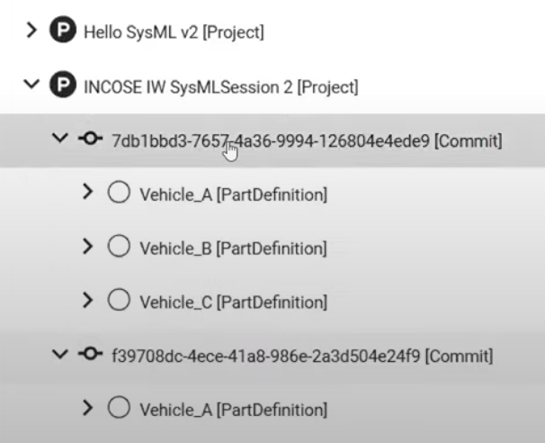

# SysMLv2 API Requests Notes and Questions- JSON and SYSML Files 

## Notes
Inside the JSON response (e.g. to create/post a new SysMLv2 Model/Project) the ID will be generated by the SysMLv2 server hence you don't need to provide one. It is optional. 

When creating (POST) the same JSON file (SysMLv2 Model/Project) it will NOT override the current one due to its generating for each POST another id. Therefore by creating the same SysMLv2 Model, the repository has two of the same project with different IDs. 

    If you like to update the model (e.g. adding elements, ports, etc.) you have to create a commit AND using the same ID that has been generated from the server. 

### Commits: 
You can choose if you want to see every element inside the commit or only the ones that changes from one commit to the next(e.g. latest)

## Terms and Definitions
Head commit = Latest commit 

## Questions
1) Where do I know which commit is the latest one. E.g. when I'm getting all commits of a project? Is it the first one inside the "change: [...]" array?  -> probably the first commit